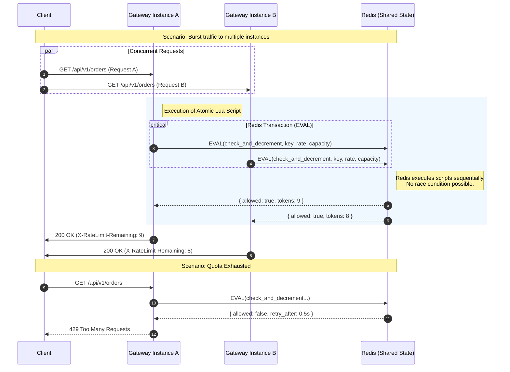

# VelocityGate Architecture

This document details the architectural design of VelocityGate, focusing on request processing, resilience patterns, and distributed state management.

## 1. Request Flow & Resilience Strategy

The request lifecycle is designed to fail fast (Authentication, Rate Limiting) and protect downstream services (Circuit Breaker) while maintaining high throughput.

```mermaid
flowchart TD
    Client([Client Request]) -->|HTTP/HTTPS| Gateway[VelocityGate Entry Point]

    subgraph Pipeline [Request Processing Pipeline]
        direction TB

        %% 1. Authentication (Order: -100)
        Gateway --> Auth{1. Authentication Filter}
        Auth -- Invalid/Missing Key --> 401[401 Unauthorized]
        Auth -- Valid Key --> RL{2. Rate Limit Filter}

        %% 2. Rate Limiting (Order: -50)
        RL -- Check Quota --> Redis[(Redis Cluster)]
        Redis -- Lua Script Result --> RL
        RL -- Limit Exceeded --> 429[429 Too Many Requests]
        RL -- Allowed --> CB{3. Circuit Breaker}

        %% 3. Circuit Breaker (Spring Cloud / Resilience4j)
        CB -- "State: OPEN" --> Fallback[Fallback Response / 503]
        CB -- "State: CLOSED / HALF_OPEN" --> LB[4. Load Balancer]

        %% 4. Load Balancing & Routing
        LB -- "Select Instance" --> ServiceDisc[Service Registry / DB]
        ServiceDisc -- Instance URI --> LB
        LB --> Proxy[Netty Routing Filter]
    end

    %% Backend Interaction
    Proxy -->|Forward Request| Backend[Backend Microservice]

    %% Response Handling
    Backend -->|Success (2xx)| Success[Update Metrics: Success]
    Backend -->|Failure (5xx/Timeout)| Failure[Update Metrics: Failure / Trip Circuit]

    %% Styling
    classDef error fill:#f8d7da,stroke:#dc3545,color:#721c24;
    classDef success fill:#d4edda,stroke:#28a745,color:#155724;
    classDef redis fill:#e2e3e5,stroke:#383d41,stroke-dasharray: 5 5;
    classDef filter fill:#cce5ff,stroke:#004085;

    class 401,429,Fallback,Failure error;
    class Success,Backend success;
    class Redis,ServiceDisc redis;
    class Auth,RL,CB,LB,Proxy filter;
```

## 2. Distributed Rate Limiting

To support horizontal scaling, rate limiting state is synchronized across all Gateway instances using Redis. We employ Lua scripts to ensure atomicity and prevent race conditions (e.g., "Time of Check to Time of Use" bugs).



## 3. Component Architecture

The system is built on Spring Boot and Spring Cloud Gateway, modularized into distinct layers for Security, Resilience, and Observability.

```mermaid
componentDiagram
    package "API Gateway Core" {
        [Netty Server]
        [RouteLocator]
    }

    package "Custom Filters" {
        [AuthenticationFilter]
        [RateLimitFilter]
        [LoggingFilter]
        [LoadBalancerFilter]
    }

    package "Services" {
        [ApiKeyService]
        [RateLimitConfigService]
        [AnalyticsService]
        [JwtService]
        [ServiceRegistryService]
    }

    package "Data Access" {
        [ApiKeyRepository]
        [RateLimitConfigRepository]
        [ServiceRepository]
        [CircuitBreakerStateRepository]
        [UserRepository]
    }

    database "Infrastructure" {
        folder "PostgreSQL" {
            [Tables: users, api_keys, rate_limits]
        }
        folder "Redis" {
            [Keys: rate_limit:*, cache:*, analytics:*]
        }
    }

    node "Observability" {
        [Prometheus Scraper]
        [Micrometer Registry]
        [Actuator Endpoints]
    }

    %% Relationships - Flow
    [AuthenticationFilter] --> [ApiKeyService] : Validates Key
    [RateLimitFilter] --> [RateLimitConfigService] : Fetches Rules
    [RateLimitFilter] --> [Redis] : Atomically Check Limit

    %% Relationships - Data
    [ApiKeyService] --> [ApiKeyRepository]
    [RateLimitConfigService] --> [RateLimitConfigRepository]

    [ApiKeyRepository] ..> [PostgreSQL]
    [RateLimitConfigRepository] ..> [PostgreSQL]

    %% Observability Integration
    [CircuitBreaker (Resilience4j)] --> [Micrometer Registry] : Emits Events
    [LoggingFilter] --> [AnalyticsService] : Async Metrics
    [Prometheus Scraper] ..> [Actuator Endpoints] : Pulls Metrics

    %% Style adjustments
    classDef service fill:#e1f5fe,stroke:#01579b;
    classDef db fill:#fff3e0,stroke:#e65100;
    class [ApiKeyService],[RateLimitConfigService],[AnalyticsService] service;
    class [PostgreSQL],[Redis] db;
```
