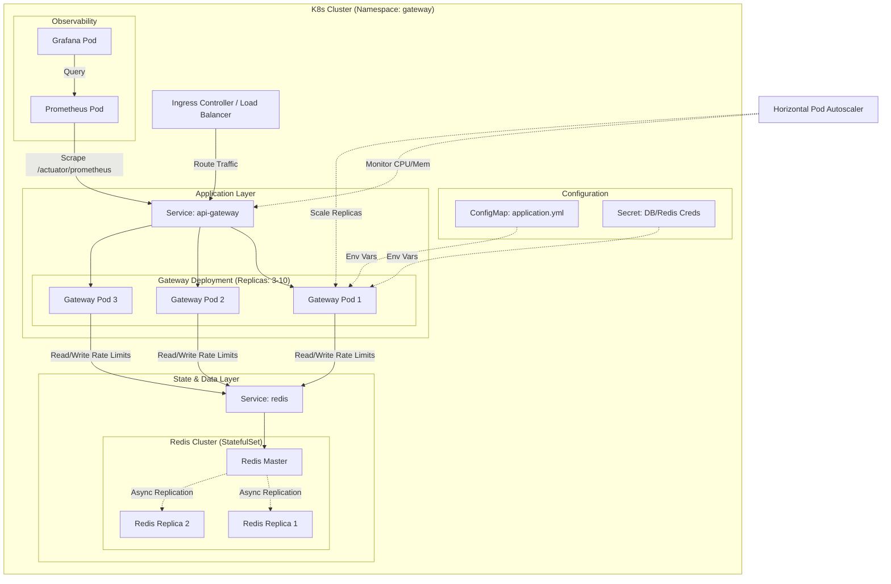
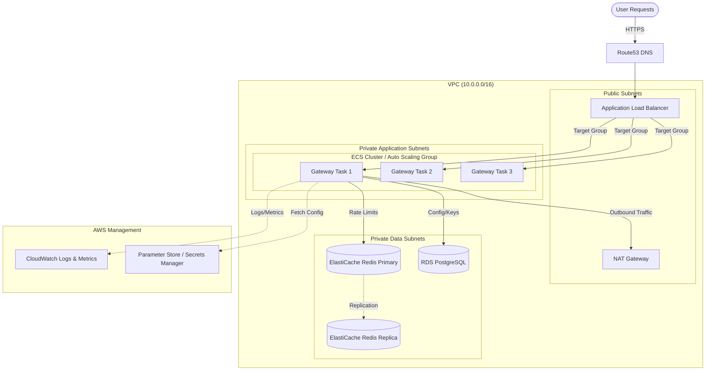

# VelocityGate Deployment Architecture

This document outlines the deployment strategies for VelocityGate, covering Kubernetes, AWS cloud-native setup, and High Availability configurations.

## 1. Kubernetes Deployment

This diagram illustrates a production-grade Kubernetes cluster setup. The Gateway scales horizontally based on CPU/Memory usage (HPA), with state offloaded to a Redis Cluster.



### Key Components

- **Ingress**: Manages external access (SSL termination, path routing).
- **HPA**: Automatically scales Gateway pods between 3 and 10 replicas based on load.
- **Redis**: Deployed as a StatefulSet with Master-Replica architecture for failover.
- **Secrets**: Sensitive data (passwords, keys) injected securely as environment variables.

---

## 2. AWS Cloud Architecture

This architecture leverages AWS managed services for maximum reliability and minimal operational overhead.



### Infrastructure details

- **Compute**: ECS Fargate or EC2 Auto Scaling Group for stateless gateway instances.
- **Networking**: Processing and Data layers are isolated in private subnets, accessible only via the ALB.
- **State**: ElastiCache (Redis) handles the high-throughput rate limit counters.
- **Config**: AWS Systems Manager Parameter Store holds configuration and secrets.

---

## 3. High Availability (Multi-Region)

For mission-critical deployments requiring 99.99% uptime and disaster recovery.

```mermaid
flowchart TB
    Client([Global Client]) --> GLB{Global Load Balancer / Route53}

    subgraph "Region A (Active)"
        LB_A[Load Balancer A]
        App_A[VelocityGate A]
        Redis_A[(Redis Primary A)]
    end

    subgraph "Region B (Passive / Warm Standby)"
        LB_B[Load Balancer B]
        App_B[VelocityGate B]
        Redis_B[(Redis Primary B)]
    end

    %% Routing
    GLB -->|Primary Traffic| LB_A
    GLB -.->|Failover| LB_B

    %% Local Flow
    LB_A --> App_A --> Redis_A
    LB_B --> App_B --> Redis_B

    %% Data Sync strategies
    Redis_A <==>|Active-Active (CRDT) or Async Replication| Redis_B

    classDef region fill:#f9f9f9,stroke:#333,stroke-width:2px;
    class Region A,Region B region;
```

### HA Strategy

- **Active-Passive**: Region B is standby. Redis data is asynchronously replicated. In a failover event, users are routed to Region B. Rate limits might reset or be slightly stale depending on replication lag.
- **Active-Active**: Using Redis Enterprise or DynamoDB (Global Tables) allows both regions to accept writes. Note that "Strict" global rate limiting adds significant latency; "Eventually Consistent" limiting is preferred for multi-region performance.
