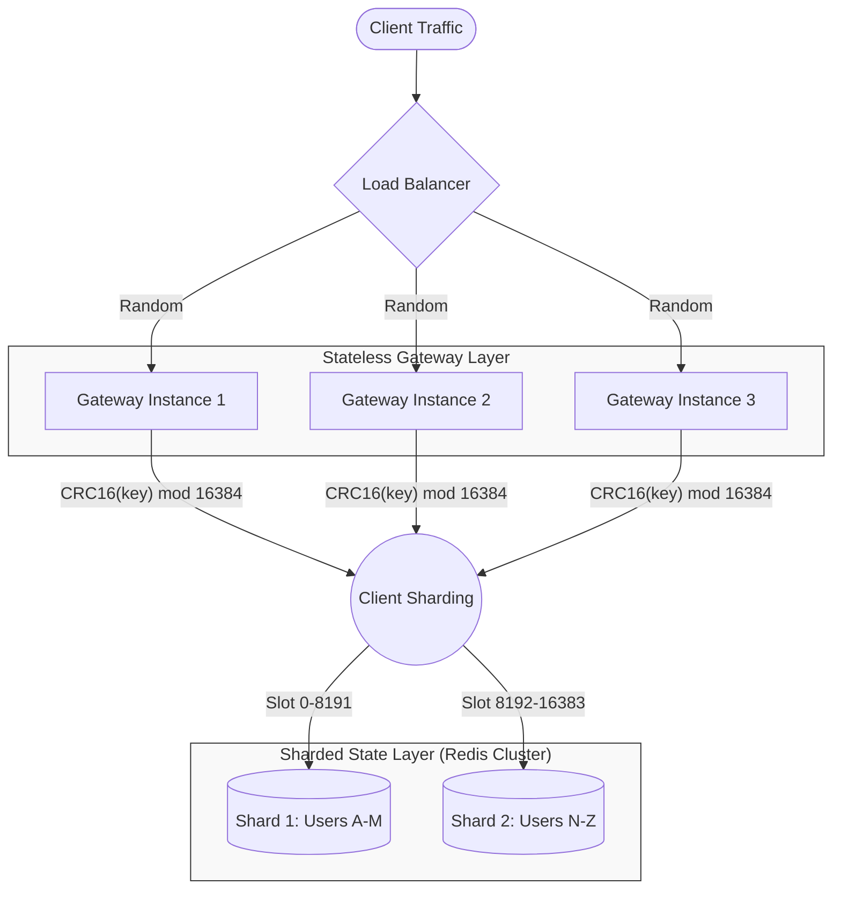
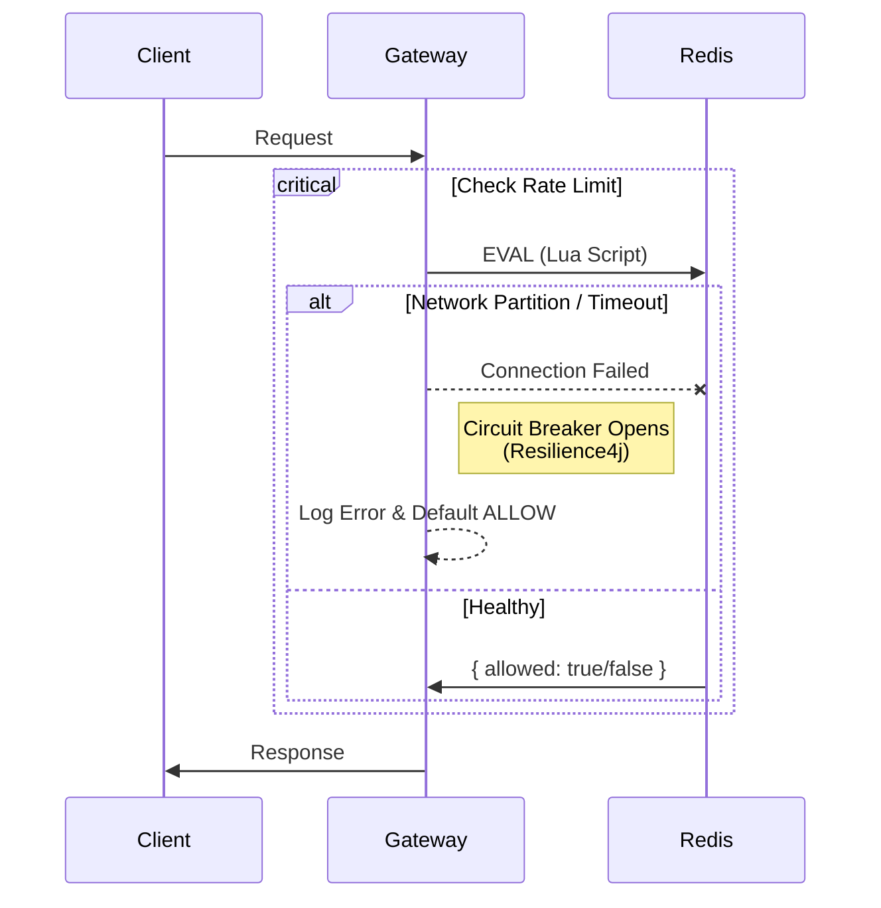

# Distributed Systems Behavior

This document analyzes VelocityGate through the lens of distributed systems theory, detailing consistency models, scaling characteristics, partition tolerance, and synchronization strategies.

## 1. Consistency Model & Linearizability

VelocityGate implements a **Strong Consistency** model for rate limiting counters within a single region, leveraging Redis as the linearization point.

### Architectural Guarantees

- **Atomicity**: All rate limit checks are executed via Lua scripts (`EVAL`). Redis guarantees that these scripts execute atomically. This is equivalent to a critical section in a threaded environment but applied to the distributed store.
- **Linearizability (CAP Theorem - CP)**:
  - For a given key (e.g., `rate_limit:user:123`), all operations are serialized by the Redis master node responsible for that hash slot.
  - This ensures that concurrent requests from separate Gateway instances observe a total ordering of events.
  - _Trade-off_: In the event of a Redis master failure, the system is unavailable for that shard until failover completes (CP behavior), unless configured to fail-open.

### Why not Eventual Consistency?

Eventual consistency (e.g., CRDTs or gossip protocols) allows counters to diverge and reconcile later. For strict rate limiting (e.g., "max 10 requests/sec"), this creates a "leaky" window where a burst of thousands of requests could breach the limit before convergence. VelocityGate prioritizes strict enforcement by default.

---

## 2. Scaling Behavior & Bottlenecks

System throughput scales linearly with Gateway instances, provided the Redis backend is not saturated.

### Request Distribution Strategy

Traffic is distributed randomly (Round Robin) by the Load Balancer to stateless Gateway pods. "Sticky Sessions" are **not** required because state is externalized.

### Bottleneck Analysis

| Component       | Metric                      | Bottleneck behavior                               | Mitigation strategy                  |
| :-------------- | :-------------------------- | :------------------------------------------------ | :----------------------------------- |
| **Gateway CPU** | Crypto/SSL, Request Parsing | Linear usage increase.                            | HPA (Horizontal Pod Autoscaler).     |
| **Redis CPU**   | Lua Script Execution        | `O(1)` per request but single-threaded per shard. | Redis Cluster (Horizontal Sharding). |
| **Network BW**  | Payload size                | Saturation at NIC.                                | Compression, multiple NICs.          |

**Sharding Strategy**:
To prevent "Hot Key" issues (e.g., one tenant doing 1M RPS), VelocityGate keys should be designed with high cardinality (e.g., `rate_limit:{tenant_id}:{user_id}`).

---

## 3. Network Partitions & Failure Modes

VelocityGate must handle scenarios where the "Brain" (Redis) is unreachable. This presents a CAP Theorem choice: **Consistency** (Block requests) vs. **Availability** (Allow requests).

### Failure Strategies

#### A. Fail-Open (Default - Availability Preferred)

If Redis fails or times out, the Gateway _logs the error_ and _allows the request_.

- **Pros**: User experience is preserved; system degrades gracefully.
- **Cons**: Temporary loss of rate limiting protection.

#### B. Fail-Closed (Strict - Consistency Preferred)

If Redis fails, the Gateway returns `503 Service Unavailable`.

- **Pros**: Backend is strictly protected from overload.
- **Cons**: Total outage during Redis instability.

### Partition Handling Flow (Fail-Open)

### Split-Brain (Redis Cluster)

If the Redis cluster partitions, VelocityGate clients (Lettuce/Jedis) will attempt to reconnect to the majority partition. During the election window, writes to the minority partition will fail, triggering the configured Failure Strategy (Open/Closed).

---

## 4. State Synchronization & Time

### Truth in Time (The "Clock Skew" Problem)

Distributed rate limiting relies heavily on accurate time windows.

- **Problem**: If Gateway A is 500ms ahead of Gateway B, they may calculate window boundaries (`window_start = now / 60`) differently, causing "jittery" limits.
- **Solution**: VelocityGate's Lua scripts use **Redis Server Time** (`redis.call('TIME')`) rather than Client System Time.
  - _Benefit_: All rate limits are synchronized to the Redis Master's clock.
  - _Result_: Clock skew on Gateway instances becomes irrelevant for accuracy.

### Counter Propagation

Changes to counters are propagated instantly to the Redis Master.

- **Read Replicas**: If using `GET` from replicas for non-critical reads, there is a replication lag (usually sub-millisecond).
- **VelocityGate Implementation**: We use `EVAL` on **Masters only**. This ensures 0ms propagation delay for write-read cycles (Strong Consistency).
