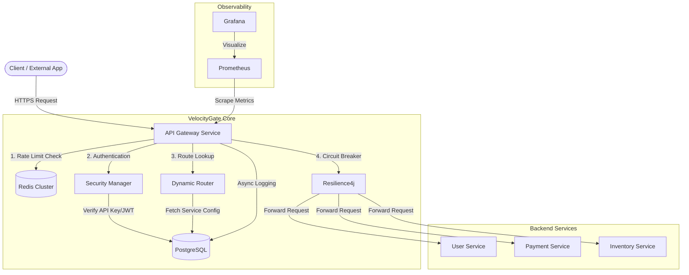

# Distributed Rate Limiter & API Gateway

A high-performance, distributed API Gateway built with Spring Boot 3.2 and Spring Cloud Gateway 4.1.

## Features

- **Distributed Rate Limiting**: Token Bucket, Sliding Window, Fixed Window, Leaky Bucket algorithms backed by Redis.
- **Authentication**: API Key (hashed) and JWT support.
- **Resilience**: Circuit Breaker pattern with Resilience4j.
- **Monitoring**: Prometheus metrics, Grafana dashboards, and detailed Request Logging.
- **Scalability**: Stateless architecture, Dockerized, Kubernetes-ready.

## Getting Started

### Prerequisites

- Java 17+
- Docker & Docker Compose
- Maven 3.9+

### Running Locally with Docker

1. **Build the project**:

   ```bash
   mvn clean package -DskipTests
   ```

2. **Start Infrastructure**:

   ```bash
   cd docker
   docker-compose up -d
   ```

3. **Access Services**:
   - API Gateway: `http://localhost:8080`
   - Prometheus: `http://localhost:9090`
   - Grafana: `http://localhost:3000` (admin/admin)

### API Usage

1. **Register Admin User** (Direct DB insert via migration or custom endpoint):
   - Default user: `admin@gateway.com`
   - Password: `Admin@123`

2. **Login to get JWT**:

   ```bash
   curl -X POST http://localhost:8080/api/v1/auth/login \
     -H "Content-Type: application/json" \
     -d '{"email":"admin@gateway.com", "password":"Admin@123"}'
   ```

3. **Generate API Key**:

   ```bash
   curl -X POST http://localhost:8080/api/v1/keys \
     -H "Authorization: Bearer <YOUR_JWT_TOKEN>" \
     -H "Content-Type: application/json" \
     -d '{"name":"My App Key", "tier":"PRO"}'
   ```

4. **Make Rate Limited Request**:
   ```bash
   curl http://localhost:8080/api/v1/users/1 \
     -H "X-API-Key: sk_live_<YOUR_API_KEY>"
   ```

## Configuration

See `application.yml` for default settings.

- Rate Limiter Algorithm defaults to `TOKEN_BUCKET`.
- Default Redis prefix: `rate_limit:`

## System Architecture

The VelocityGate architecture is designed for high availability, security, and observability. It acts as the single entry point for all microservices.



### Component Breakdown

1.  **API Gateway Core (Spring Boot 3.2)**
    - **Rate Limiter**: Distributed rate limiting using Token Bucket algorithm backed by Redis. Supports different limits per API key/Tier.
    - **Security Manager**: Handles API Key validation (hashed storage) and JWT verification for administrative endpoints.
    - **Dynamic Router**: Routes requests based on configurations stored in the database, allowing for runtime updates without restarts.
    - **Service Registry**: Custom implementation storing active service definitions in PostgreSQL.

2.  **Data Layer**
    - **PostgreSQL**: Primary persistent storage for User accounts, API Keys, Rate Limit configurations, Service definitions, and Request Logs.
    - **Redis**: High-performance in-memory store for real-time rate limit counters and caching frequently accessed configurations.

3.  **Resilience & Reliability**
    - **Resilience4j**: Implements Circuit Breaker pattern to prevent cascading failures when backend services are down or slow.

4.  **Observability**
    - **Micrometer & Prometheus**: Exposes application metrics (request types, latency, error rates, JVM stats).
    - **Grafana**: Provides visualization dashboards for monitoring system health.
